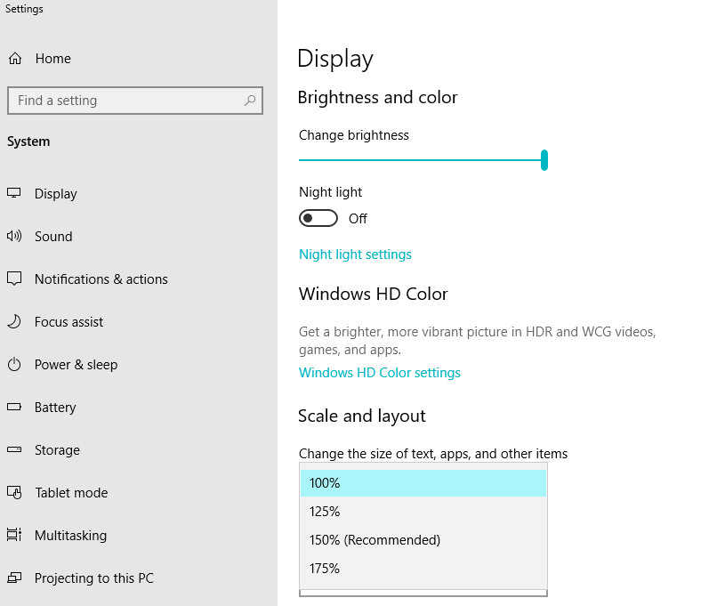

## Getting Started

This repository contains material to accompany my R Shiny Workshop.

### Introduction to R Shiny

[Shiny](https://shiny.rstudio.com/), is a framework that makes it easy to build interactive web applications (apps) straight from R. It is designed with data scientists in mind and enables professional web applications to be developed with no understanding of HTML, JavaScript or CSS. It is therefore easy to get started with Shiny. However, the basic framework is built from general building blocks that can be fully extended and customised to meet complex data engineering requirements.

The workshop will take you through the basics of making Shiny apps. It will demonstrate the capabilities of some useful packages for visualisation development and teach you how to customise your solutions so you have all you need to begin making professional web applications.
                            
### Workshop Overview

* **Tutorial 1: The Basic Shiny App** -- the components of a Shiny app, Shiny functions, input and output variables.
* **Tutorial 2: Developing Shiny** -- introduction to `data.table`, Shiny layout, control widgets, reactive expressions.
* **Tutorial 3: Customising Shiny** -- `shinydashboards`, custom CSS, `DT`, event handlers.
                            
### Set up
Shiny can be run directly within your RStudio environment. You will need to install the latest versions of [R](href="https://www.r-project.org/) and [RStudio](https://www.rstudio.com/products/rstudio/download/#download) on your computer to complete the workshop.
 
Before beginning the workshop, it would be useful to install all the packages that we will be using. For example, the Shiny package can be installed in your R package library by entering the following:
 
 
 ```r
 install.packages("shiny")
 ```
 
I have created an [install script](https://github.com/ordiology/shiny_tutorials/blob/master/install_packages.R) that can be used to install all the packages used in this workshop. The [tutorial source code](https://github.com/ordiology/shiny_tutorials/blob/master/Tutorials.zip) should also be downloaded from this GitHub repository prior to beginning the workshop. It would be a good idea copy this code into your R code directory and create a [new R project](https://support.rstudio.com/hc/en-us/articles/200526207-Using-Projects) in your RStudio environment for the workshop.
                            
The apps that have been developed for this workshop have all been designed to be displayed at 100% scale and layout. To display the apps optimally, please make sure your display settings are set up appropriately. Note that the default for a small screened Windows laptop, for example, is 150% scale and layout:
 

  
